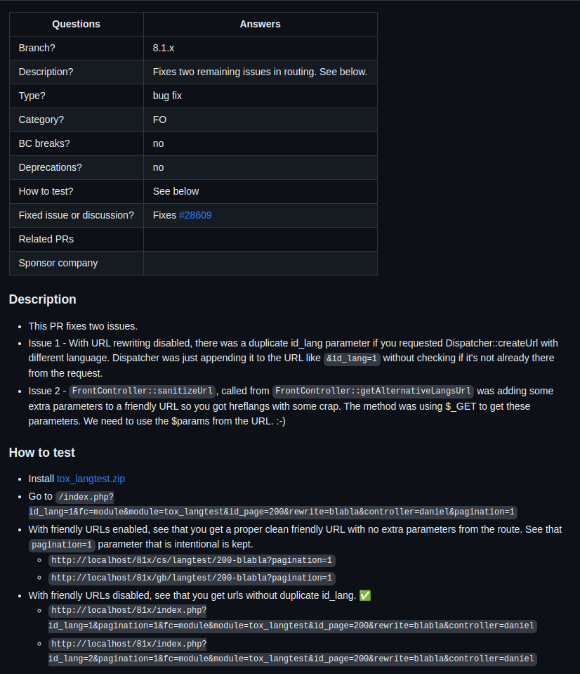
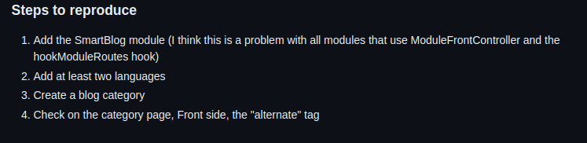
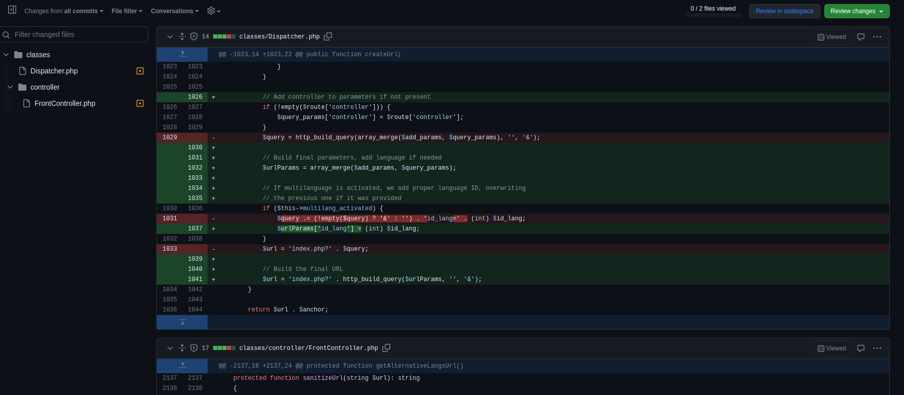
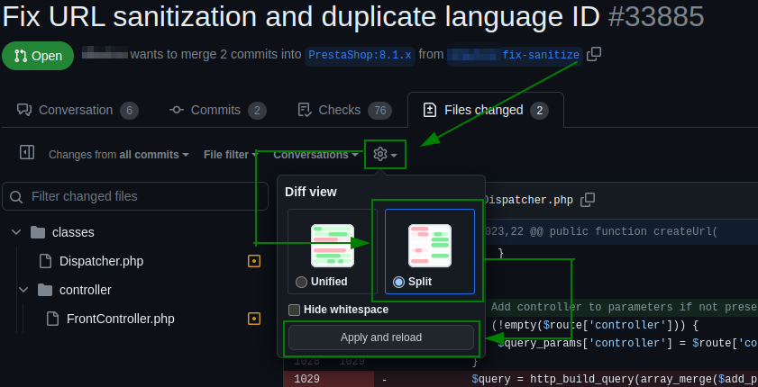
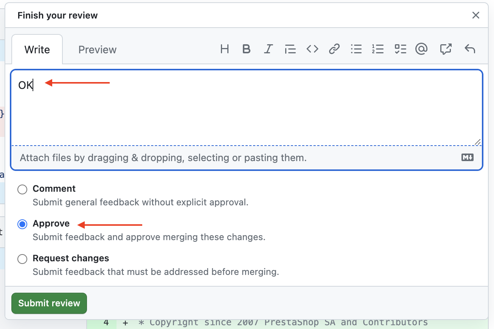
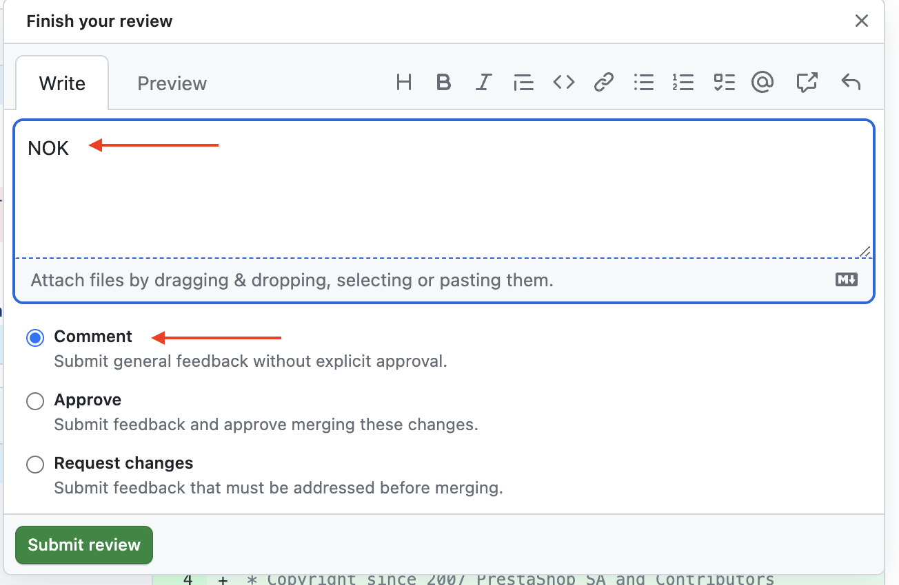
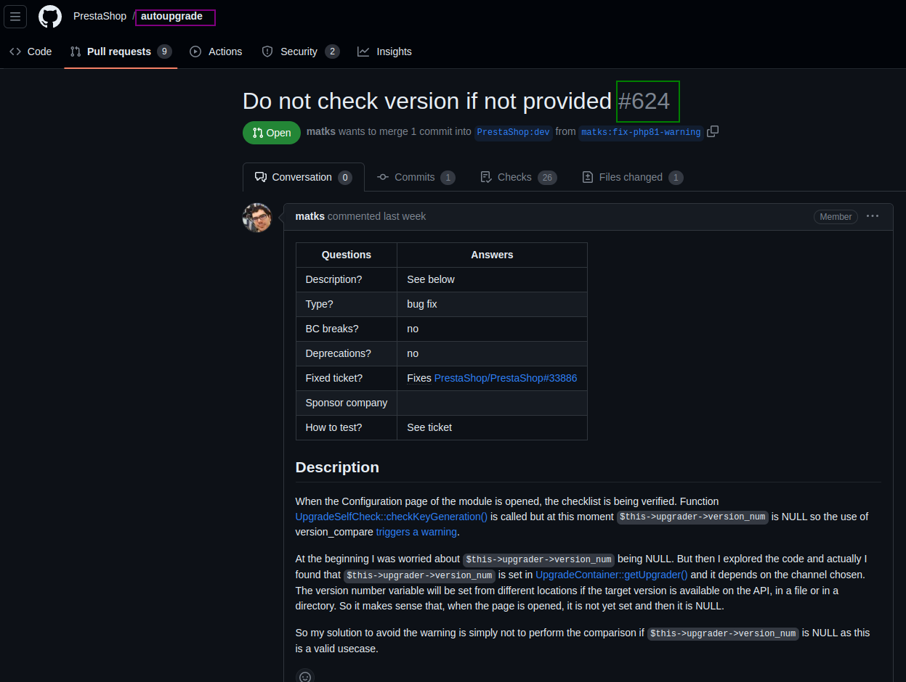
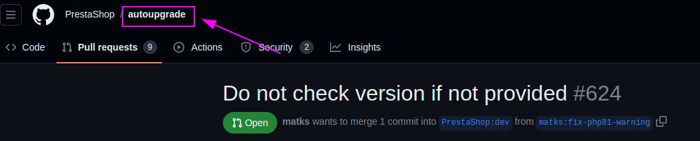
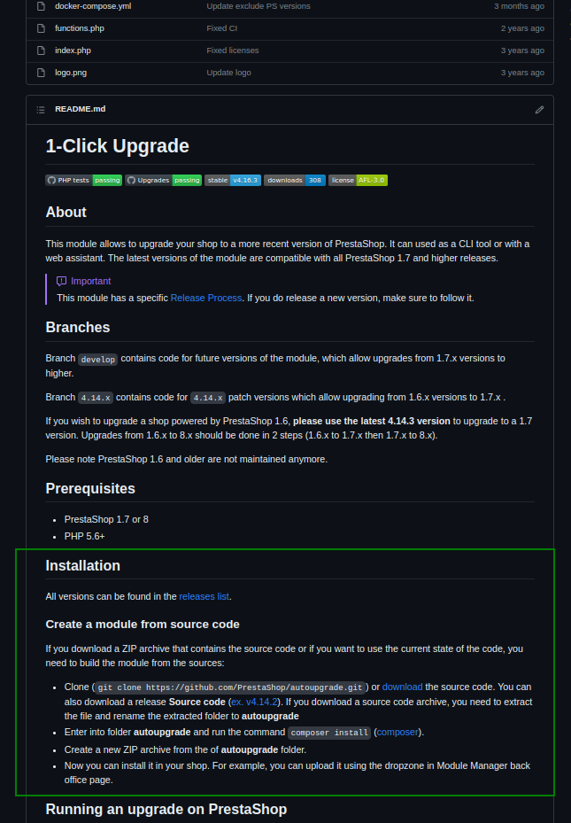

# Testing Pull Request


## How to test a PR manually

You want to take care of a PR and you don't know how to handle it, or you've simply forgotten how? No problem, this github page is for you. 


### 1. Taking information from a PR


One of the first things to do when starting a PR is to find out as much as possible about it. To do this, you'll find this table at the start of each PR



To begin with, we have the **Branch**, which will be useful for preparing our shop and automated tests. So we can already set up a shop accordingly if we don't already have a shop in this branch. 

To do this, go to your terminal and execute the commands below: 


ℹ️ For your information, we recommend that you put it in the *Computer/var/www/html* folder (this recommendation only applies to Linux users).


We can see that in **violet** we've put the "**Branch "** we're interested in and in **brown** the name of our file, which can be modified as we wish. 

Still with this **Branch**, We advise you to launch the automated Tests.

ℹ️ To start the automated tests, you can go to https://github.com/PrestaShop/ga.tests.ui.pr, on the readme.md file, you will have all the information you need to run the automated tests


### 2. Replicating the issue

Now that we have an installed shop in which the issue is still present, you can check the three elements of the table: 

- Description: Sometimes, the description will tell you where the PR is heading, but it can also tell you where it may have affected the code and which axes we'll be able to check next.
- How to Test: When this field is filled in, it enables you to easily identify a way of reproducing the issue. Often, it will simply refer to the issue linked to the PR.
- Fixed issue or discussion: When you click on the indicated issue, you'll have all the information you need to reproduce it.

Once on the issue, all you have to do is scroll down to find the "Steps to reproduce" section and follow the steps one by one, taking the example of our same PR:



If the issue has been validated by our testers, (⚠️ any PR that mentions an issue must have this issue validated by the QA, otherwise the PR will not be taken into account) the steps to reproduce must have been reviewed by them and are therefore easily reproducible. 

ℹ️ If the issue has been validated by a Developer, the PR in question should be reviewed and tested by a Dev, unless otherwise specified. 

ℹ️ If you have installed your shop in *Computer/var/www/html,* you will be able to use your shop from a web browser and put the link : *localhost/PR_81x* (this recommendation only applies to Linux users).

### 3 Installing the PR


Once we've reproduced the issue, we now need to check that the PR actually fixes the problem. To do this, we first need to install it in our shop. We'll take out the terminal in the **PR_81x** folder and you'll be able to type these commands: 


ℹ️ prc here is an alias that we set up earlier like this :
```
prc = "!f() { git checkout $3 && git branch -D pr-$2; git fetch $1 pull/$2/head:pr-$2 && git checkout pr-$2 && git reset --hard && git clean -fd && git rebase $1/$3 && composer install;  }; f" 
```

For the color code, we always use **violet** for the **Branch** and this time we'll use **green** for the **PR number**. 


We can find this **number** in the title of the PR, as you can see. 


All you have to do now is try to reproduce the issue again to see if the PR corrects it correctly.
If it's all good, you can proceed to the next step of this documentation (step 4). If not, you can directly check step 5!

### 4. Check that the PR doesn't create another issue

Now that you've checked that the PR has corrected the issue, you need to make sure that it doesn't create another one instead. To do this, you need test axes. 

To find them, go to the Files changed tab: 


You'll then have all the changes made to the PR. To do this, you'll get this view: 



Seen like this, it may seem rather difficult to see the differences and what might be impacted, so we advise you to modify the split view and save.



You now have a better view of the various modifications, and can read the whole thing. 


No computer skills? But you still need to check that it's not overflowing? There are two things you can do: 

- From which **file** the modification was made. You can see on the screen the name of the **file** framed in **Orange**. By seeing the names, I can tell that it will be on the front by the name "FrontController".
- Thanks to the **comments**. These are framed in **blue**, meaning that there won't necessarily be a **comment** in each PR. You just need to read them to find out what the changes are and see what incidents they might create.

Following this search and the various checks, you should now have the results of the automated tests. If there are any fails, you can re-run the failed tests.
If you still have so many failures on the automated tests, you can test them manually on your shop. 


### 5. Responding to contributors


Once the PR test has been completed, there are two possible situations:


- The PR is valid, it doesn't create any other issue. In this case, we advise you to indicate that it works, to put a video proving it (you may think it's the desired behavior but it's not) and to put the link to the automated tests if you ran them.
In your comment, you'll need to select the Approve option before submitting the review.

    
    
- The PR is not valid. In this case, indicate that it doesn't work, put a video showing that it doesn't work and put the link to the automated tests if you ran them (to prove that it brings issues).
If the PR corrects the issue but creates others, it is necessary to specify the steps to reproduce the issue(s) caused by the PR, so that the PR author can correct the errors more easily.
In your comment, you'll need to select the Comment option before submitting the review. The Request changes option will force the same QA to respond to the same PR, whereas it would be preferable for someone else to test it once the changes have been made.



As you can see, in both cases, you'll have to provide a video and a link to the automated tests to show your good faith.

ℹ️ Yes, even when the PR is valid, it's better to offer a video. This will allow future QAs to see how we're supposed to behave with the PR. Very useful when we're doing test plans / release plans or when we have to go back on a PR. 

### Bonus - Module testing

If you come across a Module PR, the process remains the same as for a PR (in broad terms). What will change is the installation process. 

To do this, start by opening your PR: 



We've framed the PR version in **Green** and the "branch "** in **Purple**, represented here by **autoupgrade**. 

We're going to perform the same operations from the beginning to step 3

ℹ️ We don't need to run the auto test, as it doesn't work with modules.

So we're going to run a special command in the terminal linked to our shop folder: 


ℹ️ If your module includes a .json package, you need to add this command line for your module to function correctly

```jsx
npm install && npm run build
```

ℹ️ If you want to install your module directly (if it's not native), you can run this command in your terminal: 

```jsx
compose install
```

For the color code, we always use **violet** for the **Branch** and we'll use **green** for the **PR number**. 

This is one of the few things that is different from a "normal" PR. We can now test the module PR and repeat the same process as in step 4.

For your information ℹ️:

If you still can't install the module PR, you'll probably find some hint in its *readme*. 



Click on the **branch** link then scroll down and you'll find an Installation section:


