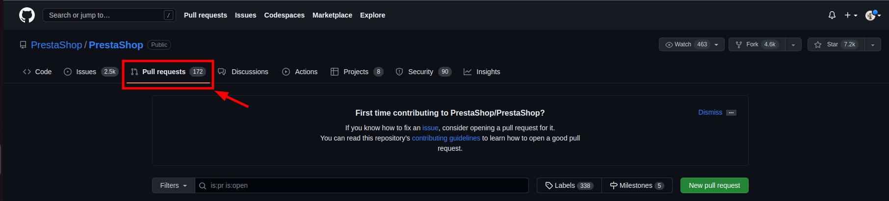
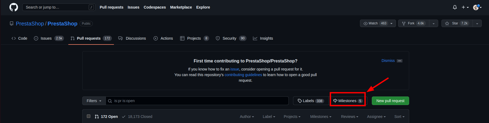
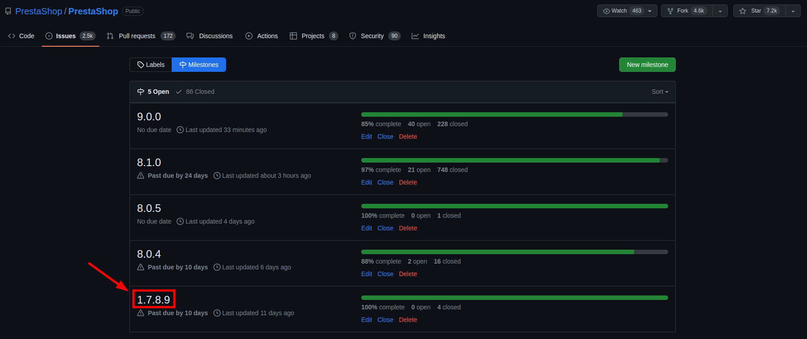
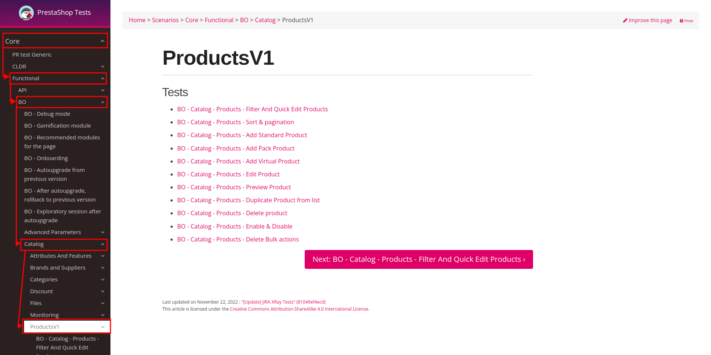
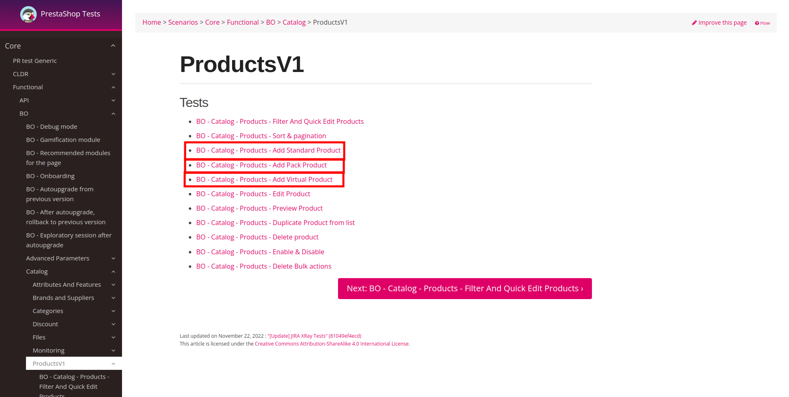

# How to create a Test Plan / Release Plan

When a new release is made by the developers, a Test Plan and a Release Plan must be created on the QA side. 

The purpose of this page is to explain how to create these different tickets before carrying out a release. 

## 1. Know the release

The first thing to do is to find out about the release you're going to test. 

To do this, simply : 

1. Go to Prestashop Pull requests: 

2. Click on Milestones

1. Click on the version you require (for this example, it will be 1.7.8.9) 

4. Click on Closed (these are the merged PRs for the selected version) 

You now have the list of all the PRs merged in your release. It's highly recommended that you check them all to find out what these PRs might affect. 

## 2. List the test scenarios

Now that you know what your release is about, you're going to list the different test scenarios. You'll need support to take notes. 

Again, we'll do this in a few steps: 

1. Open [Prestashop project](https://build.prestashop-project.org/test-scenarios/)

1. Select the various repository affected by the PRs (e.g. a change in product creation) 

3. Once you've identified the different scenarios that interest you, write them down (or mark them in your notepad). 

If you've followed all these steps, you should now have your list of test scenarios which should be tested for this release, which you can share with your team members and developers. 

All that's left for you to do now is carry out the various tests and, at the end of the day, share with the team, made up of PMs and Developers, if we've encountered any issues during our work.

Happy Release.