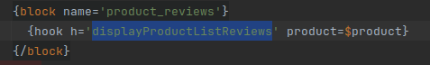

# Testing Hooks with `ps_qualityassurance`

Hooks are not easily testable. So a module [`ps_qualityassurance`](https://github.com/PrestaShop/ps_qualityassurance) has been created to test this module.

## Installation

### Fetch the ZIP module

* Go to the [releases page of the module](https://github.com/PrestaShop/ps_qualityassurance/releases)
* Download the ZIP asset of the module linked to the latest release

### Install the module

* Go to your BackOffice
* Go to the "Modules" > "Module Manager" page
* Click on the "Upload a module" button
* Select the previous downloaded file
* The module is installed.


{class="text-center"}

## Usage

### Test an `action` Hook

#### Context

In this example, we try to check if the hook `actionProductPriceCalculation` is called in frontoffice.


{class="text-center"}

We can see that the price is passed as reference. We will modify the price with `ps_qualityassurance`. 

#### Example

* Go the configuration page of the module
* Click on the tab "Register Hook"
* For the hook name, use `actionProductPriceCalculation`
* For the content, use 
```php
  if ($params['use_tax']) {
      $params['price'] = 42.00;
  } else {
      $params['price'] = 35.00;
  }
```
* Register the hook
* Go to the frontoffice
* The hook runs well


{class="text-center"}

### Test a `display` Hook

#### Context

In this example, we try to check if the hook `displayProductListReviews` is called in frontoffice.


{class="text-center"}

We can see that the product is passed as parameter. We will use the product for displaying a new text with `ps_qualityassurance`. 

#### Example

* Go the configuration page of the module
* Click on the tab "Register Hook"
* For the hook name, use `displayProductListReviews`
* For the content, use 
```php
  return 'Your product "' . $params['product']['name'] . '" has the ID ' . $params['product']['id'] . '.';
```
* Register the hook
* Go to the frontoffice
* Go to a category page
* The hook runs well


{class="text-center"}