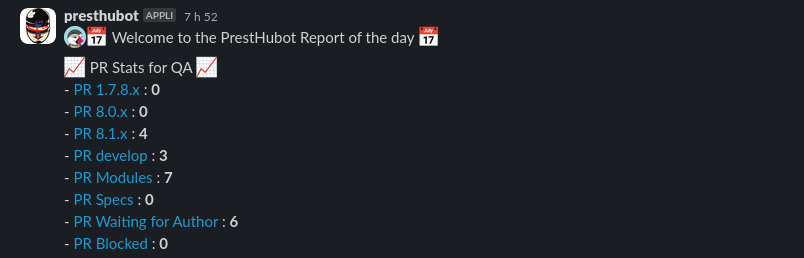
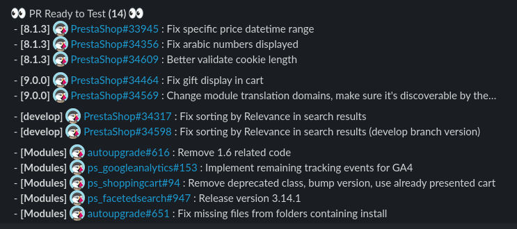
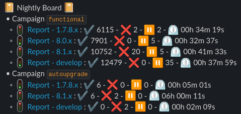
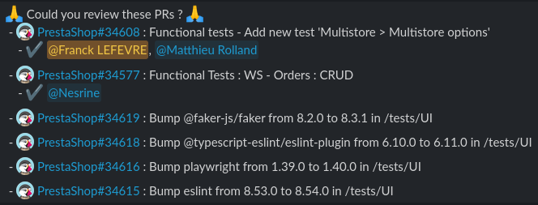
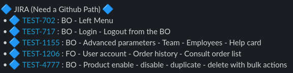
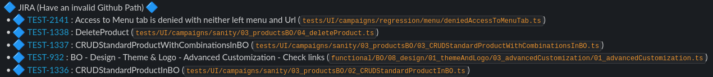
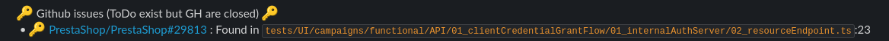

# PrestHubot

## Goal

Presthubot is the QA team's Slack Notifier. It checks several rules and sends a report via Slack.

## Schedule

Every week day at 06:45 AM

## Code

You can find the workflow on [Github](https://github.com/PrestaShop/presthubot/blob/master/.github/workflows/slacknotifier.yml).

## How it works

We can divide the process in two parts : QA Functional & QA Automation.

### QA Functional

#### PR Stats for QA

This returns the number of Pull Requests that are pending: 
* on the various branches under development
* on modules
* on specifications

But also the PRs awaiting their author, and those that are blocked.

#### PR Ready to Test

This returns Pull Requests that are awaiting QA on the various branches under development and on the modules.

### QA Automation

#### Nightly Board

This returns the nightly status of the various branches under development and the autoupgrade module.

By status, we mean the number of tests that have passed, failed and are skipped, as well as the processing time.

#### PR Ready to Test

This returns the various Pull Requests to be reviewed by the project's Software Developers in Test. It also indicates which maintainers have already approved them.

#### JIRA (Need a Github Path)

This returns the various scenarios on JIRA which have been automated but which have not defined the test URL.

#### JIRA (Have an invalid Github Path)

This returns the various scenarios on JIRA which have been automated but which have an invalid URL for the test.

#### Github issues (ToDo exist but GH are closed)

In UI tests, the Software Developer in Test skips some tests due to the presence of bugs. To do this, they add a comment with the link to the issue representing the bug. Presthubot checks every day that the issues remain open as long as the comments are present. This means that a test can be activated as soon as the bug has been corrected (when the developer has not activated the test).