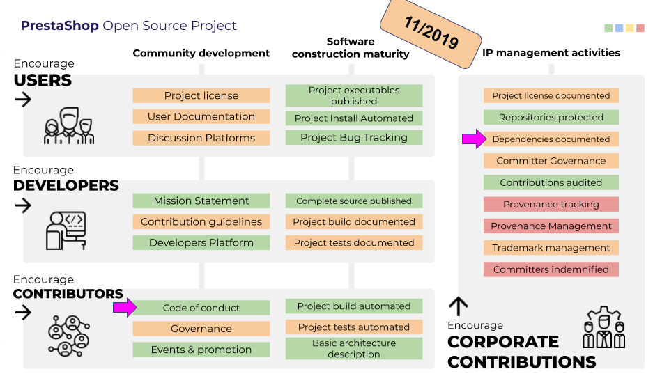
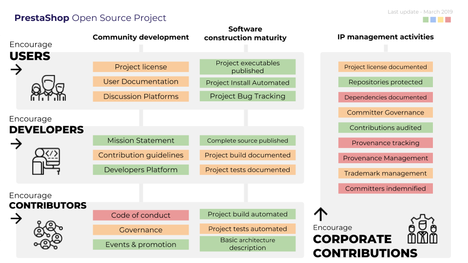

Hello,

[]

This repository aims to improve the overall maturity of the PrestaShop open source project.

It contains:
- source code and content for www.prestashop-project.org (https://github.com/PrestaShop/open-source/actions/workflows/build.yml)
- materials about the open source project evolution

# The Dashboard

## November 2019




## March 2019



The Dashboard will be updated when tasks are completed and a status has changed.

# Resources

Follow the work on the Kanban: https://github.com/PrestaShop/open-source/projects/1

[Link to the presentation](https://docs.google.com/presentation/d/e/2PACX-1vTEbW-otnpKF8qrXMdgaMJg1HWYOqW4R2fVAXzw_YY-g0KubhlbPLVUVmutBoy4lvDUpWr736JO1aCG/pub) with the details (part of the content is in french and will be translated).

# Rendering the site locally

1. Clone the repository somewhere on your system:
    ```
    git clone --recurse-submodules https://github.com/PrestaShop/open-source.git
    ```

**Note** normal cloning will not work. You _must_ recurse the submodules or hugo will not understand shortcodes and you will see errors such as: 
  `failed to extract shortcode: template for shortcode "children" not found`

2. Switch to the `open-source` directory:
    ```
    cd open-source
    ```

3. Install Hugo (optional if already installed):
    ```
    ./bin/installHugo.sh
    ```

4. Launch Hugo:
    ```
    hugo server
    ```
