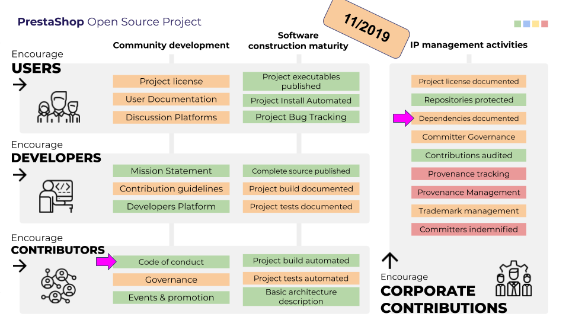
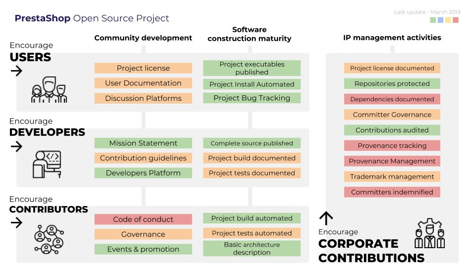

Hello,

This repository aims to improve the overall maturity of the PrestaShop open source project.

It also hosts the source of the website https://www.prestashop-project.org/

# The Dashboard

## November 2019

## March 2019

The Dashboard will be updated when tasks are completed and a status has changed.

# Resources

Follow the work on the Kanban: https://github.com/PrestaShop/open-source/projects/1

[Link to the presentation](https://docs.google.com/presentation/d/e/2PACX-1vTEbW-otnpKF8qrXMdgaMJg1HWYOqW4R2fVAXzw_YY-g0KubhlbPLVUVmutBoy4lvDUpWr736JO1aCG/pub) with the details (part of the content is in french and will be translated).
